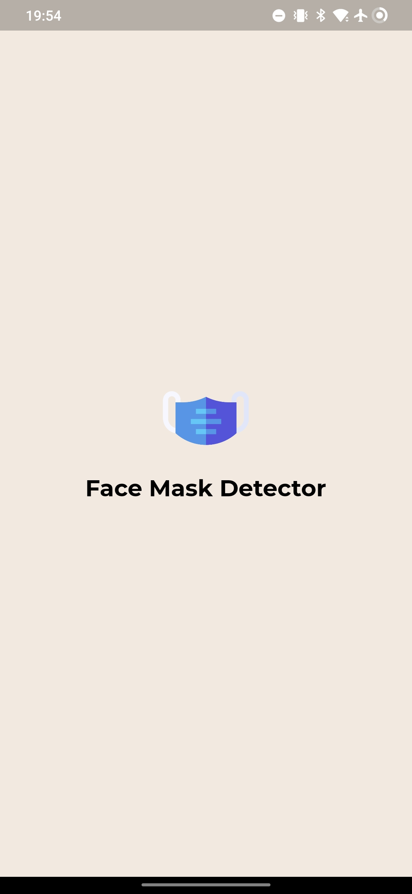
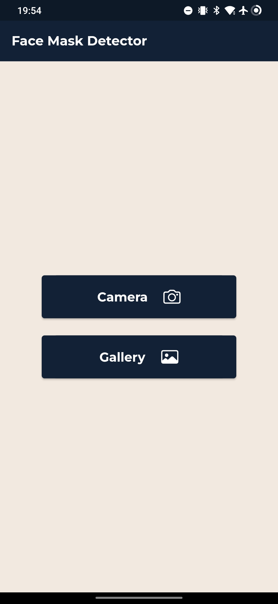

# Face Mask Detector App

A Flutter-based mobile application that detects whether a person is wearing a face mask or not by analyzing images taken from the camera or gallery.

## Features

- Detects face masks in images captured using the camera or selected from the gallery.
- Provides real-time analysis and prediction for mask detection.
- User-friendly interface for seamless image capture and analysis.

## Screenshots

    
    
    
    

## How to Use

1. **Camera Mode:**
    - Tap on the "Camera" button to capture an image using the device's camera.
    - The app will analyze the image and display the result of mask detection.

2. **Gallery Mode:**
    - Tap on the "Gallery" button to select an image from the device's gallery.
    - The app will analyze the selected image and provide mask detection results.

## Installation

### Requirements
- Flutter SDK
- Android Studio / Xcode (for Android / iOS development)

### Steps to Run the App
1. Clone the repository.
2. Navigate to the project directory.
3. Run `flutter pub get` to install dependencies.
4. Connect a device or use an emulator.
5. Run `flutter run` to launch the app on your device/emulator.

## Libraries and Dependencies

- [Flutter](https://flutter.dev/)
- [Tflite_v2](https://pub.dev/packages/tflite_v2)
- [Image Picker](https://pub.dev/packages/image_picker)
- [Flutter Screen Util](https://pub.dev/packages/flutter_screenutil)
- [Google Fonts](https://pub.dev/packages/google_fonts)

## Contributors

- [Ashutosh Mishra](https://github.com/TheScriptRailoth)

